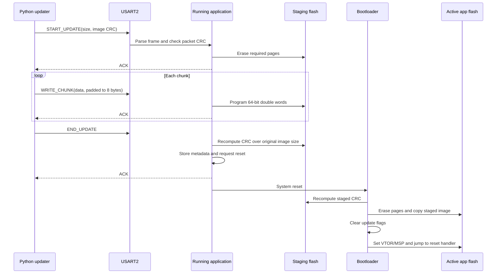

# STM32L476 Hardware and Firmware Guide

This guide walks from the physical NUCLEO-L476RG setup through the UART wire protocol, flash update code, Cortex-M handoff, and the key peripheral registers. Values below are taken from the current project source, linker scripts, and CubeMX configuration. In case older notes disagree, `bootloader/Bootloader/Core/Inc/flash_map.h` and the linker scripts define the build's actual addresses.

## 1. Bench Setup and Hardware Connections

### Required hardware

- STM32 NUCLEO-L476RG board, with its STM32L476RG MCU.
- USB cable to the board's ST-LINK USB connector. The onboard ST-LINK provides SWD programming/debug and, on the usual NUCLEO-L476RG routing, a USB Virtual COM Port connected to USART2.
- PC with STM32CubeIDE or STM32CubeProgrammer, Python 3, and `pyserial`.

No external SPI flash, EEPROM, level shifter, or separate debug probe is required for the repository's normal setup. The firmware images and update staging area are in the MCU's internal flash.

### Signals used by the project

| Function | MCU signal | Direction at MCU | Notes |
|---|---|---|---|
| UART transmit | PA2 / USART2_TX / AF7 | Output | Connects to host receive; debug `printf` also uses this UART. |
| UART receive | PA3 / USART2_RX / AF7 | Input | Receives updater packets from the host. |
| User LED | PA5 / GPIO output | Output | The applications toggle LD2 on the Nucleo board; the application UART RX callback also toggles it. |
| Programming/debug | PA13/SWDIO, PA14/SWCLK, GND via ST-LINK | Bidirectional | Used to flash the bootloader and recover a board. The onboard probe routes these signals internally. |
| Reset | NRST / board reset button | Input to MCU | Starts the boot sequence; useful for entering the bootloader's five-second update window. |

For the onboard USB Virtual COM Port, select the COM port that Windows creates. If using an external 3.3 V USB-UART adapter instead, wire MCU PA2/TX to adapter RX, MCU PA3/RX to adapter TX, and connect grounds. Use 3.3 V logic; do not connect a 5 V UART signal. Keep the board's existing power arrangement and do not join competing 5 V supplies.

The USART2 mapping is in the application's and bootloader's `HAL_UART_MspInit()` implementations. The `.ioc` also identifies PA2 as USART2_TX, PA3 as USART2_RX, and PA5 as GPIO_Output. Board revisions or solder-bridge changes can alter the onboard Virtual COM Port route, so verify that route if the Windows COM port sees no UART traffic.

The custom bootloader is an ordinary flash-resident program at `0x08000000`; setting the MCU's BOOT0 pin to enter ST's factory ROM bootloader is not part of this update flow. The Nucleo reset button restarts the custom bootloader already programmed in flash.

### First-time flash and normal update use

1. Build the bootloader project and program its ELF with CubeIDE, or program `bootloader/Bootloader/Debug/Bootloader.bin` at `0x08000000` with CubeProgrammer.
2. Program an application image linked for `0x08008000` if the active slot is blank.
3. Connect the board's USART2 Virtual COM Port and note its COM name.
4. Run `python -m pip install pyserial` once, then send an image while the application is running:

   ```powershell
   python tools/updater.py send COM3 115200 application/Application/Debug/Application.bin
   ```

5. Replace `COM3` and the final path as appropriate. An older saved `.bin` can be sent with the same command for rollback.

The application receives updates continuously. The bootloader also has a five-second UART receive window after reset. The `.bin` is a raw byte stream and does not carry a load address; always use an image linked for the active application base. Do not program an application `.bin` at the bootloader base.

## 2. MCU Clock and Peripheral Configuration

The application and bootloader both use MSI as the system clock and divide AHB/APB clocks by one. Their current `SystemClock_Config()` settings differ: the bootloader selects MSI range 6 (4 MHz), while the application selects range 8 (16 MHz). USART2 is configured for 115200 baud, 8 data bits, no parity, one stop bit, transmit and receive enabled, no hardware flow control, and 16x oversampling. HAL derives the USART baud divider from the active peripheral clock.

The application `.ioc` enables USART2, CRC, NVIC, and SysTick. USART2 MSP initialization enables the USART2 and GPIOA clocks, configures PA2/PA3 for alternate function 7, and enables the USART2 interrupt. The application starts one-byte interrupt-driven UART reception with `HAL_UART_Receive_IT()` and rearms it after every received byte.

For oversampling by 16, the USART baud divisor is approximately `fPCLK / baud`: about 139 for the application's 16 MHz PCLK1 and 115200 baud, and about 35 for the bootloader's 4 MHz PCLK1. HAL calculates and writes `BRR`; actual baud is quantized to the nearest supported divisor. A clock change therefore changes the UART bit timing unless the peripheral clock or baud setting is changed too.

## 3. Internal Flash Map

The STM32L476RG has 1 MiB of internal flash. This project divides it into four non-overlapping regions:

| Region | Start | End (inclusive) | Size | Purpose |
|---|---:|---:|---:|---|
| Bootloader | `0x08000000` | `0x08007FFF` | 32 KiB | Reset-time update manager and application handoff. |
| Active application | `0x08008000` | `0x0807FFFF` | 480 KiB | Firmware that executes after boot. |
| Staging image | `0x08080000` | `0x080F7FFF` | 480 KiB | Incoming candidate image. |
| Metadata area | `0x080F8000` | `0x080FFFFF` | 32 KiB | Persistent update state; the current metadata writer uses its first 2 KiB page. |

The STM32L476RG has two 512 KiB flash banks in dual-bank configuration. The active image is in Bank 1 after the 32 KiB bootloader. Staging begins at Bank 2's base. Flash pages are 2 KiB; page erases operate on whole pages, not individual bytes. For a size `S`, the code erases `ceil(S / 2048)` pages before programming.

The erase-page indices are bank-relative in the HAL call: active app begins at Bank 1 page 16, staging begins at Bank 2 page 0, and metadata begins at Bank 2 page 240. The metadata reservation spans 16 pages, while the current metadata writer erases only page 240 because the metadata structure fits there.

The application linker script sets `FLASH ORIGIN = 0x08008000, LENGTH = 480K`; the bootloader linker sets `FLASH ORIGIN = 0x08000000, LENGTH = 32K`. SRAM1 is 96 KiB at `0x20000000` through `0x20017FFF`; the linker scripts also describe SRAM2, but this project does not need a separate app/bootloader RAM partition.

`docs/memory-map.md` now uses this four-region layout. An older two-row summary that treated all remaining flash as one application was incomplete: staging and metadata are reserved from that space.

## 4. Reset, Vector Tables, and Application Handoff

On Cortex-M reset, the processor reads two words from the active vector table: the initial Main Stack Pointer (MSP) and the reset-handler address. The bootloader image's vector table starts at `0x08000000`; the application's starts at `0x08008000` because its linker origin is relocated.

The bootloader's `go2APP()` checks that the first application vector resembles an SRAM stack pointer, reads the reset vector, disables interrupts and SysTick, deinitializes its UART, clears NVIC enable and pending bits, sets the vector table address, loads MSP, reenables interrupts, and calls the application's reset handler. This approximates a hardware reset handoff; it is a direct branch, not a second physical reset.

The application's `SystemInit()` also sets `SCB->VTOR` using `VECT_TAB_OFFSET = 0x8000`, so later exceptions and interrupts resolve through the application vector table. The initial stack pointer must be in SRAM1. The reset-handler address in the image must point into the application flash region and have the Thumb-state bit set.

The bootloader's stack-pointer check is a sanity filter, not cryptographic or complete image validation. The additional vector check in the bootloader UART fallback checks the SRAM1 range and that the reset handler lies in the active app slot.

## 5. Firmware Update Sequence



The running application's receive path is the usual route. A direct polling receiver also exists in the bootloader and runs for five seconds after bootloader initialization. Either route stages the candidate; the reset-time `iap_check_and_apply_update()` then verifies and applies it. If no update is requested, the bootloader attempts to jump to the current active application.

### Application receiver steps

1. The USART2 interrupt receives bytes and calls `uart_rx_byte_handler()` through `HAL_UART_RxCpltCallback()`.
2. A small parser waits for the `0xAA` start marker, command, length, payload, and packet CRC. A partial frame expires after the configured receive timeout.
3. The application main loop calls `main_loop_process_uart()`. It checks the packet CRC and dispatches the command.
4. `START_UPDATE` carries the image size and final image CRC. The receiver validates size, erases the required staging pages, and resets its sequential staging offset.
5. `WRITE_CHUNK` carries up to 256 bytes of image data, with the final chunk padded with zero bytes to an 8-byte boundary. The receiver writes double words at the current staging offset and acknowledges the chunk.
6. `END_UPDATE` causes the receiver to CRC the original image length in staging. If it matches, the receiver records the staging size/CRC and apply request in metadata, sends ACK, waits briefly for UART transmission, and calls `NVIC_SystemReset()`.
7. On reset, the bootloader rechecks the staged image CRC before erasing the active application pages and copying the staged image into the active slot.

### Packet format and command IDs

All multi-byte packet fields use big-endian order. The frame is:

```text
0xAA | command: 1 byte | payload length: 2 bytes | payload | payload CRC32: 4 bytes
```

The packet CRC is zlib-compatible CRC32 over the payload only. ACK/NACK replies are eight bytes: start marker, reply command, zero payload length, and CRC32 of the empty payload (zero).

| Command | Value | Payload |
|---|---:|---|
| `START_UPDATE` | `0x01` | 32-bit image size followed by 32-bit image CRC. |
| `WRITE_CHUNK` | `0x02` | Up to 256 sequential image bytes, padded to a multiple of 8 bytes for flash programming. No chunk offset is included in the current application protocol. |
| `END_UPDATE` | `0x03` | Empty; requests final CRC check and apply. |
| `ACK` | `0x04` | Empty reply. |
| `NACK` | `0x05` | Empty reply. |
| `APPLY_UPDATE` | `0x06` | Empty; applies a previously staged image if metadata marks it valid. |

The host waits for an ACK after each packet and retries up to five times. The application protocol is sequential rather than offset-addressed: the receiver advances its write offset only after a successful chunk write. The host-side updater uses zlib CRC32; the MCU CRC configuration is selected to produce the same CRC value.

## 6. CRC Theory and Peripheral Use

CRC (cyclic redundancy check) is an error-detection code. The project uses the standard CRC-32 polynomial `0x04C11DB7`, initial value `0xFFFFFFFF`, byte input/output inversion to implement the reflected byte ordering used by zlib, and a final XOR with `0xFFFFFFFF`. `crc32_zlib_compatible()` wraps the STM32 hardware CRC peripheral through `HAL_CRC_Calculate()`.

There are two integrity checks at different boundaries:

- Packet CRC: detects a damaged or malformed individual UART payload before its command is accepted.
- Image CRC: detects corruption across the complete firmware image in staging. It is computed by the host, checked by the application, and recomputed by the bootloader from flash before apply.

CRC does not authenticate who sent the image and is not a cryptographic signature. Anyone who can send UART data can create a different image with its matching CRC. Production secure boot needs signature verification and a protected trust key.

The CRC peripheral uses registers such as `CRC->DR` (data), `CRC->CR` (control/reset), `CRC->INIT` (initial value), and `CRC->POL` (polynomial when programmable polynomial mode is selected). In this project the default polynomial is selected; HAL setup and input/output inversion provide the zlib-compatible behavior.

## 7. Flash Programming Theory and Registers

Internal flash is nonvolatile and memory-mapped into the Cortex-M address space, so code can read image bytes as ordinary memory. Programming is constrained: erase a page before changing its contents, program at the supported granularity, and do not attempt to turn a programmed zero bit back to one without erasing its page.

The project uses the HAL sequence:

1. `HAL_FLASH_Unlock()` unlocks flash control using the hardware key sequence.
2. `__HAL_FLASH_CLEAR_FLAG(FLASH_FLAG_ALL_ERRORS)` clears stale status/error flags.
3. `HAL_FLASHEx_Erase()` selects a bank, page, and page count.
4. `HAL_FLASH_Program(FLASH_TYPEPROGRAM_DOUBLEWORD, address, data)` writes 64 bits at an 8-byte-aligned address.
5. `HAL_FLASH_Lock()` relocks the controller.

At register level, the HAL operates on FLASH key registers (`FLASH->KEYR`), status (`FLASH->SR`), and control (`FLASH->CR`). Page erase uses the page-erase control and page-number fields; double-word programming sets the programming control and writes the two 32-bit halves to flash. The project's HAL calls are preferred over direct register writes because they sequence waits, errors, cache handling, and locks.

On this device, the relevant FLASH control concepts are `LOCK` (relock controller), `PG` (program), `PER` (page erase), `PNB` (page number), `BKER` (bank selection for page erase), and `STRT` (start erase); `SR` reports busy, completion, and error conditions. Unlock writes the documented key sequence to `KEYR`. The exact masks are defined in the STM32L4 HAL/device headers, not duplicated in application code.

Staging writes are at `0x08080000`; the active copy is at `0x08008000`. Metadata is memory-mapped at `0x080F8000` and stored as six 32-bit fields (24 bytes, three double words): magic, staging-valid flag, image size, image CRC, apply-request flag, and app version. The current updater does not assign or enforce the app-version field; metadata updates preserve its prior value.

## 8. Important Registers and Core Concepts

| Register or core state | Role in this project |
|---|---|
| `RCC` clock and peripheral-enable registers | Select MSI clock/dividers and enable GPIOA, USART2, and CRC clocks through HAL macros. |
| `GPIOA->MODER`, `GPIOA->AFR[0]`, `GPIOA->OTYPER`, `GPIOA->PUPDR` | Configure PA2/PA3 as USART2 alternate function 7, push-pull, no pull; configure PA5 as LED output in the application. |
| `USART2->CR1`, `CR2`, `CR3`, `BRR` | Configure UART mode, 8N1 framing, oversampling, and baud divisor. HAL reads/writes the data registers and status flags during interrupt or polling transfers. |
| `NVIC` enable/pending/priority registers | Enable USART2 interrupts; the bootloader disables and clears interrupt state before handing control to the application. |
| `SysTick->CTRL`, `SysTick->VAL` | HAL time base used by `HAL_GetTick()`, timeout logic, and delays. The bootloader stops it before the direct application handoff. |
| `SCB->VTOR` | Selects which vector table handles exceptions and interrupts. The application table is at `0x08008000`. |
| MSP and `PRIMASK` | `__set_MSP()` loads the application's initial stack; `__disable_irq()` / `__enable_irq()` control maskable interrupts during handoff. |
| `CRC` peripheral registers | Compute packet and complete-image CRC values. |
| `FLASH->KEYR`, `SR`, `CR` | Unlock, observe status/errors, and control erase/program operations through HAL. |

CMSIS names such as `SCB`, `NVIC`, `SysTick`, and `__set_MSP()` are typed core-register definitions/intrinsics; they are not ordinary RAM variables. Peripheral definitions are provided by the STM32 device header. HAL functions wrap many peripheral-register details but do not remove the underlying hardware constraints.

In more detail, GPIOA is clocked by `RCC->AHB2ENR.GPIOAEN` (bit 0), USART2 by `RCC->APB1ENR1.USART2EN` (bit 17), and CRC by `RCC->AHB1ENR.CRCEN` (bit 12). For PA2/PA3, each `GPIOx_MODER` field is set to alternate-function mode (`10`), and the corresponding `GPIOx_AFRL` nibble is AF7. PA5's mode is general-purpose output (`01`); push-pull is selected by clearing its `OTYPER` bit and no pull is selected in `PUPDR`.

USART2 `CR1` controls enable, receiver, transmitter, word length, and oversampling; `CR2` selects stop bits; `CR3` controls hardware flow control; and `BRR` sets the baud divisor. `ISR` provides receive/transmit status, with bytes transferred through `RDR` and `TDR`. `USART2_IRQHandler()` calls `HAL_UART_IRQHandler()`, which invokes the registered receive-complete callback. The NVIC's enable, pending, and priority registers determine whether that interrupt can run; the bootloader clears enable and pending state before handoff. `SysTick->CTRL` enables the core timer and its interrupt, while `VAL` is cleared during handoff so the application starts its own HAL tick cleanly.

## 9. Source Map

| File | Responsibility |
|---|---|
| `bootloader/Bootloader/Core/Inc/flash_map.h` | Authoritative flash-region addresses and sizes. |
| `bootloader/Bootloader/Core/Src/main.c` | Boot reset path, UART fallback receive window, basic image/vector checks, and `go2APP()` handoff. |
| `application/Application/Core/Src/main.c` | Application initialization, USART2/CRC setup, and main-loop UART processing. |
| `application/Application/Core/Src/uart_protocol.c` | Interrupt-fed frame parser, commands, staging writes, CRC checks, ACK/NACK, and reset request. |
| `application/Application/Core/Src/stm32l4xx_hal_msp.c` | Peripheral clocks, GPIO alternate-function pins, and NVIC setup. |
| `application/Application/Core/Src/stm32l4xx_it.c` | USART2 IRQ entry, HAL dispatch, and SysTick handler. |
| `application/Application/Application.ioc` | CubeMX source configuration for the MCU, USART2 pins, CRC, NVIC, and SysTick. |
| `bootloader/Bootloader/Core/Startup/startup_stm32l476rgtx.s` | Reset vector table and low-level reset entry that calls the C runtime before `main()`. |
| `bootloader/Bootloader/Core/Src/iap_apply.c` | Boot-time staged CRC recheck, active-slot erase/copy, and apply-state clearing. |
| `bootloader/Bootloader/Core/Src/metadata.c` and `Core/Inc/metadata.h` | Metadata serialization, persistence, and initialization. |
| `bootloader/Bootloader/Core/Src/crc_util.c` | Hardware CRC configuration and zlib-compatible CRC wrapper. |
| `application/Application/STM32L476RGTX_FLASH.ld` | Relocates application code and vectors to `0x08008000`. |
| `bootloader/Bootloader/STM32L476RGTX_FLASH.ld` | Places bootloader code and vectors at `0x08000000`. |
| `tools/updater.py` | Host framing, payload CRC, chunk padding, serial retries, and update command flow. |
| `application/Application_Update/` | Alternate application project/image for exercising application updates. |

## 10. Guarantees and Limitations

- A partial transfer does not set a new apply request; the active image is not erased while bytes are still arriving.
- The bootloader recomputes the staged image CRC before modifying the active slot.
- The active slot is overwritten on a successful apply. This is not a two-active-slot A/B design. Keep a known-good `.bin` on the host for rollback.
- Apply is CRC-checked but not power-fail atomic. Power loss after active-page erase and before copy completion can leave the active image unusable; recovery then requires ST-LINK reprogramming or another recovery path.
- The application-side `END_UPDATE` path validates CRC but does not itself validate the candidate's vector table. The bootloader fallback receiver does a basic vector check. The normal reset-time IAP path rechecks CRC but not the vector table before copy; the later jump performs a stack-pointer sanity check. A CRC-valid but incorrectly linked image can therefore be copied and then fail to boot.
- The CRC provides integrity against accidental corruption, not authenticity, confidentiality, anti-rollback, or access control.
- If a new image is shorter than the old one, the active erase routine erases only enough pages for the new size. Bytes after the new image can remain stale; they are outside the new image's declared size and should not be treated as a preserved backup.
- The application `.ioc` and generated source configure USART2/CRC, but application and bootloader currently use different MSI ranges. If clock settings change, keep host baud and UART clock assumptions aligned.
- The current sequential `WRITE_CHUNK` command has no sequence number or offset. If the device writes a chunk but its ACK is lost, an automatic retry can be interpreted as the next chunk and shift the image. The host retries packets, but the application receiver does not make accepted writes idempotent; robust protocols should add offsets/sequence numbers and duplicate detection.

These constraints make the project useful for learning UART framing, linker relocation, CRC, internal flash programming, and reset handoff, but it should not be treated as a secure or power-fail-safe production updater without further work.